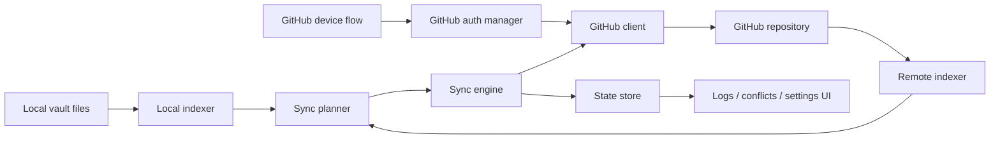

# Architecture

## Purpose

This plugin synchronizes Obsidian vault content with a GitHub repository through the GitHub REST API, without requiring a local Git client.

## Current structural map

- `src/main.ts` — plugin entrypoint, command wiring, lifecycle
- `src/clients/` — GitHub API access and remote repository operations
- `src/auth/` — GitHub App device flow, token refresh, and auth session management
- `src/indexers/` — local and remote indexing of files and metadata
- `src/core/` — planning, conflict handling, and sync execution
- `src/storage/` — persisted plugin state and sync baseline data
- `src/types/` — shared models and settings
- `src/ui/` — settings, sync log, and conflict-facing UI
- `tests/` — module-level and integration-style verification

## High-level sync flow

## Remote indexing strategy

- prefer an incremental remote view based on `compareCommits` when a baseline commit is available
- detect incomplete compare responses and fall back to a full tree fetch when GitHub paging or the changed-file cap may hide files
- detect truncated recursive tree responses and walk the tree in smaller requests when needed
- treat remote `.gitkeep` blobs as empty-folder placeholders rather than as ordinary synced note files
- filter the remote index to the configured remote sync root before planning

## Execution safety model

- the sync engine can generate a persisted preview before execution
- suspicious local delete sets require an explicit approval key before sync execution continues
- sync preview, conflicts, and health state are stored locally so the user can inspect the last plan after a blocked or failed run
- a dedicated baseline-repair action rebuilds the stored baseline from current local and remote state without silently widening sync scope

## GitHub client behavior

- uses conditional GETs where practical so unchanged GitHub responses can reuse cached data
- tracks the latest visible rate-limit headers for health reporting
- throttles mutating requests to avoid bursty write patterns against the GitHub API
- keeps auth refresh separate from request construction so runtime call sites do not read tokens directly

## Trust boundaries

1. **Local Obsidian runtime**
   - reads vault files under the configured local sync root, or the whole vault when it is left empty
   - stores plugin state and credentials locally
2. **Configured GitHub repository**
   - receives synchronized note and attachment data
   - can receive synced content at repository root or under a configured remote sync root such as `vault/`
   - becomes the remote source of sync truth for the configured branch
3. **Repository automation**
   - builds, tests, and packages the plugin code
   - must never require production tokens for ordinary CI

## Security-sensitive surfaces

- GitHub App auth state when that flow is enabled
- GitHub App client metadata such as the client ID and install URL
- synced note content and attachments
- path metadata and sync baselines
- stored sync preview and health records
- conflict artifacts and logs
- release workflows and GitHub Actions permissions

## Non-goals of the baseline

- becoming a general-purpose Git client
- syncing arbitrary local app configuration by default
- adding telemetry or cloud services beyond the configured GitHub repository
- silently changing plugin identity or release channel policy

## Changes that require an ADR

- plugin identity or repository/release channel changes
- token storage redesign
- `.obsidian/` or settings-folder sync behavior changes
- new network endpoints or analytics
- new release or packaging policy that affects users or reviewers
