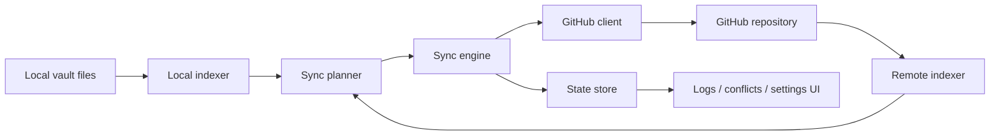

# Architecture

## Purpose

This plugin synchronizes Obsidian vault content with a GitHub repository through the GitHub REST API, without requiring a local Git client.

## Current structural map

- `src/main.ts` — plugin entrypoint, command wiring, lifecycle
- `src/clients/` — GitHub API access and remote repository operations
- `src/indexers/` — local and remote indexing of files and metadata
- `src/core/` — planning, conflict handling, and sync execution
- `src/storage/` — persisted plugin state and sync baseline data
- `src/types/` — shared models and settings
- `src/ui/` — settings, sync log, and conflict-facing UI
- `tests/` — module-level and integration-style verification

## High-level sync flow

## Trust boundaries

1. **Local Obsidian runtime**
   - reads vault files
   - stores plugin state and credentials locally
2. **Configured GitHub repository**
   - receives synchronized note and attachment data
   - becomes the remote source of sync truth for the configured branch
3. **Repository automation**
   - builds, tests, and packages the plugin code
   - must never require production tokens for ordinary CI

## Security-sensitive surfaces

- GitHub personal access tokens
- synced note content and attachments
- path metadata and sync baselines
- conflict artifacts and logs
- release workflows and GitHub Actions permissions

## Non-goals of the baseline

- becoming a general-purpose Git client
- syncing arbitrary local app configuration by default
- adding telemetry or cloud services beyond the configured GitHub repository
- silently changing plugin identity or release channel policy

## Changes that require an ADR

- plugin identity or repository/release channel changes
- token storage redesign
- `.obsidian/` or settings-folder sync behavior changes
- new network endpoints or analytics
- new release or packaging policy that affects users or reviewers
